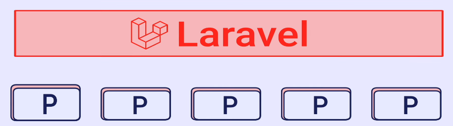
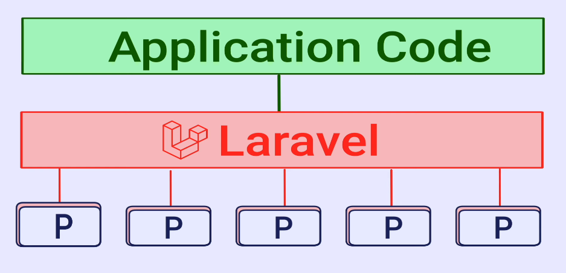
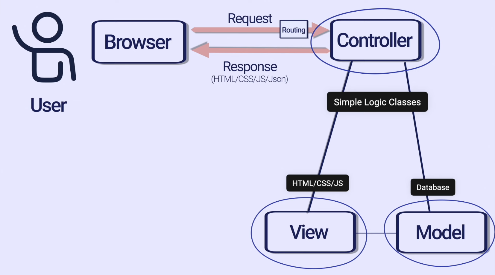
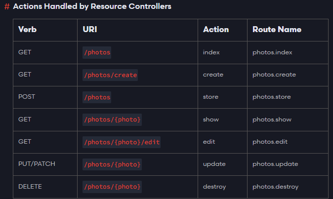

# Curriculum :

### 0️⃣ what is framework && why use framework ?✅
### 1️⃣ history of laravel ✅
### 2️⃣ Composer & Some basics ✅
### 3️⃣ MVC  design pattern ✅
### 4️⃣ blade template engine ⛔
### 5️⃣ CRUD👇
### 6️⃣ introduction to bootstrap css framework❌
### 7️⃣ naminig & resource controllers❌
### 8️⃣ database (migration & models)❌
### 9️⃣ request validation❌
### 🔟 how to chosse & install pakage❌


# 0️⃣- what is framework && why use framework ?
## 1 - What Does Package Means ?
Reusable code that mostly solves a specific problelm

هي مجموعة من الأكواد التي نعيد إستخدامها من أجل أن نقوم بحل مشكلة
محددة على سبيل المثال مسألة التحقق من شكل الإيميل يحتوي على @ وينتهي
ب @gmail.com يجب أن أكتب الكود يدويا من أجل القيام بهذه المهمة و هنا
يأتي دور ال Packges حيث أنك تقوم بكتابة الدالة وتمرر لها برامتر 
مناسب وتقوم هي بالباقي مثلا md5(anasscode) => uIuQoCkvt04pz34qSBQc2...


## 2 - What Does Framework Means ?
Reusable code that mostly solves multiple general purpose problems

هي مجموعة من الأكواد التي نعيد إستخدامها من أجل أن نحل أكثر من مشكلة
مثلا أتصل بقاعدة البيانات و أرسل لها مجموعة من الإستعلامات و أيضا 
تحديد مسار الصفحات www.anass.com/test/hello فهنا أنا بحاجة إلى 
إستعمال Framework لأجل حل مجموعة من المشاكل والقيام بالعديد من 
المهمام

كما هو موضح في الصورة فإن ال Framework يستعمل مجموعة من Packages 
للقيام بالعديد من المهام وحل أكثر من مشكلة


## 3 - Why Use Framework?
+ Save time

توفير الوقت مثلا كتابة المنطق الخاص بوضع المعلومات و إستيراد
 البيانات من Database ال Framework يقوم بها تلقائيا و مجموعة من العمليات الأخرى 

يعني أن ال Framework جعلني أوفر الوقت من خلال أنه تكلف بالمنطق الخاص
بالعمليات وأصبح بإمكانك من خلال إستعمال ال Framework التركيز على ال Application Code الخاص بك


+ Maintainability

الصيانة الخاصة بالFramework تكون تلقائية من طرف مطورين ال Framework
مثل حل مشاكل الإطار إضافة Features جديد تحديث مستمر ....

+ Eco System

له مجموعة من الناس يشرحونه و له مؤتمرات من أجل توضيح طريقة العمل 
به وشرح التحديثات

# 1️⃣ history of laravel ✅

مؤسس إطار العمل Laravel هو المطور Taylor Otwell سنة 2011 و جاءت فكرة
إنشاء الإطار Laravel بسبب أن الإطار السابق Code Egniter لم يعد قادر
على مواكبة تطور لغة PHP ويحتوي على سطور كثيرة

إطار العمل Laravel قائم على مفهومين رئيسيين هما إختصار الشفرة بحيث أن
المهمة التي كانت تنجز ب 10 سطور أصبحت تنجز بسطر واحد 
أما المفهوم الثاني هو ال Happynes developper بحيث أنك تكون سعيد
وأنت تستعمل أكواد الإطار يعني البساطة و الوضوح

# 2️⃣ Composer & Some basics ✅

 ال composer يقوم تحميل وتنظيم ال Dependencies في مشروع ال Laravel
 من خلال الأمر التالي:

+ Start CMD :
    > Windows + R => cmd => OK
+ Create New project :
    > composer create-project laravel/laravel anass-app
+ Change Directory to anass-app :
    > cd anass-app
+ Start Project in VScode :
    > code . 
+ Start Project :
    > php artisan serve //قم بكتابة ال IP الذي سوف يظهر في المتصفح
+ Stop Project :
    > Ctrl + C
+ إذا أردت القيام بالبحث عن سطر كود في المشروع كامل فقط قم بالتالي :
    > Right clic on 'anass-app' + choose"Find in Folder" + write anything you want
+ إذ أرت إستعمال أكواد داخل ملف *.blade.php فتعرف على Syntacs من 
خلال التالي:
    > Entre to "Laravel Website" => Documentation => Search about "Blade Template"
+ جميع أكواد ال Front-End يتم وضعها في المسار التالي :
    > anass-app\resources\views\..
+ Routes المشروع يتم وضعها في الملف التالي :
    > anass-app\routes\web.php
+ جميع الأوامر التي تحتاجها في ال artisan
    > php artisan list 
### 2️⃣.1 web.php :
مثال تقربي من أجل الفهم فقط
```php
//===={ الكود الأصلي }====

//"إسم الكلاس"
class Route {
    //"دالة إسمها get تأخذ بارامترين"
    public static function get( 
        //"مسار الصفحة"
        $uri ,
        //"callback function يعني لما يتم الدخول إلى المسار $uri يتم تنفيذ $function مباشرة"
        $function
        ){
        //"هنا يتم إستعمال $uri و $function من أجل أن يفتح المسار المطلوب"
    }
}

//===={إستدعاء الدالة مع تمرير البارامترات}====

Route::get( '/'
            ,
            function () {
                //دالة تعرض الملف welcome.blade.php في ال Browser
                return view('test');
            }
);
```
### 2️⃣.2 test.blade.php :
التعرف على syntacs بعض العمليات
```php
// طريقة حجز متغير
@php
    $name = 'anass';
    $books = ['PHP' , 'JavaScript', 'Dart & Flutter'];
@endphp

//طريقة طباعة متغير
//Don't use this
<?php echo $name ?>
//Use this
{{$name}}
{{$books}}

// طريقة تمرير متغير من ال Route
//welcome.blade.php
<p>
    //print var
    {{$name}}
    {{$age}}

    //print list
    @foreach($books as $book)
    {{$book}}
    @endforeach
</p>
//web.php
Route::get('/', function () {
    $book = ['PHP', 'HTML'];
    return view('welcome' , [
        'name' => 'akera',
        'age' => 30,
        'books' => $book
    ]);
});
```
### 2️⃣.3 controller :
في حالة أن المشروع عندي أصبح يحتوي على أكواد Logic كثيرة يجب أن
تقوم بإنشاء controllers لكي تتجنب مشكل وضع مجموعة من الأكواد
المسؤولة عن Logics متنوعة في كود واحد ومن أجل مزيد من التنظيم

+ Create new controller
    >php artisan make:controller //=> write "TestController" => choose something

### use controller :

```php

// عوض كتابة الأكواد في ملف ال web.php نقوم بكتابتاها في TestController بهذا الشكل
<?php
namespace App\Http\Controllers;
use Illuminate\Http\Request;

class TestController extends Controller //StudlyCase
{
    public function firstAction() { //comelCase
        $book = ['PHP', 'HTML'];
        return view('welcome' , ['name' => 'akera', 'books' => $book]);
    }
}

// In web.php :

//طريقة 1

//تحديد مسار الكونترولر
use App\Http\Controllers\TestController;
//إستدعاء الدالة المطلوبة من الكونترولر
Route::get('/', [TestController::class, 'firstAction']);

//طريقة 2
Route::get('/', ['App\Http\Controllers\TestController', 'firstAction']);

```

# 3️⃣ MVC  design pattern :

### 3️⃣.1 Design Patterns :
ال Design Patterns هي مسميات لحلول مشاكل تتكرر بشكل دوري في ال Software لا أكثر ولا أقل
يمكنك الإطلاع عليه من الموقع التالي => [https://refactoring.guru/]

### 3️⃣.2 MVC :

+ Model      ===Contain===> Database
+ View       ===Contain===> HTML/CSS/JS
+ Controller ===Contain===> Simple Logic Classes
### الخطوات
1 - المستخدم يقوم بإرسال Request من ال Browser

2 - أول ملف يتم تشغيله هو الRouting

3 - يتم توجيهه نحو ال Controller الذي يتضمن ال Logic 

4 - إما يتم توجيهه نحو ال Model أو View

5 - يعالج ال Controller البيانات

6 - يأتي ال Response نحو ال Browser على شكل (HTML/CSS/JS/JSON) 



# 5️⃣ CRUD 👇
### معني الكلمة و الإستعلامات الخاصة بها :
+ C => Create | SQL => Insert
+ R => Read   | SQL => Select
+ U => Update | SQL => Update
+ D => Delete | SQL => Delete
### Bootstrap :
البوتستراب هو عبارة عن Framework خاص ب Css مهمته هي أنه عندما أعطيه
كلاسات جاهزة في البوتستراب يقوم بإنشاء أشكال
يمكنك الحصول على جميع الأشكال من الموقع التالي => [https://getbootstrap.com/docs/5.3/components/]

### التثبيت :
فقط قم بنسخ الكود التالي وقم بوضع أي كود بوتستراب داخله سوف يشتغل
```html
<!doctype html>
<html lang="en">
  <head>
    <meta charset="utf-8">
    <meta name="viewport" content="width=device-width, initial-scale=1">
    <title>Bootstrap demo</title>
    <!--bootstrap.min.css-->
    <link   href="https://cdn.jsdelivr.net/npm/bootstrap@5.3.3/dist/css/bootstrap.min.css" rel="stylesheet" integrity="sha384-QWTKZyjpPEjISv5WaRU9OFeRpok6YctnYmDr5pNlyT2bRjXh0JMhjY6hW+ALEwIH" crossorigin="anonymous">
  </head>
  <body>
    <h1>Hello, world!</h1>
    <!--bootstrap.bundle.min.js-->
    <script src="https://cdn.jsdelivr.net/npm/bootstrap@5.3.3/dist/js/bootstrap.bundle.min.js" integrity="sha384-YvpcrYf0tY3lHB60NNkmXc5s9fDVZLESaAA55NDzOxhy9GkcIdslK1eN7N6jIeHz" crossorigin="anonymous"></script>
  </body>
</html>
```
ملاحضة : 
- الملف bootstrap.min.css مسؤول عن أكواد التصميم الخاصة بال Components
- الملف bootstrap.bundle.min.js مسؤول عن إنشاء ال logic الخاص بال Components

### تنظيم الأفكار قبل البدأ :

+ 1 - define a new route so the user can access it through browser
+ 2 - define controller that render a view
+ 3 - define view that contains lists of posts
+ 4 - remove any static html data from the view

### تثبيت مساعد :

```Powershell
# تثبيت حزمة laravel-ide-helper لتوفير دعم IDE أفضل وتحسين تجربة التطوير
composer require --dev barryvdh/laravel-ide-helper

# نشر ملفات التكوين الخاصة بـ laravel-ide-helper لتخصيص الإعدادات
php artisan vendor:publish --provider="Barryvdh\LaravelIdeHelper\IdeHelperServiceProvider" --tag=config

# إنشاء ملفات مساعد IDE لتمكين تحسين الدعم لأساليب Laravel في IDE الخاص بك
php artisan ide-helper:generate

# توليد مساعدات IDE للنماذج في التطبيق
php artisan ide-helper:models

==> في حالة ظهر مشكل قم بالتالي :
# مسح الملفات المترجمة مسبقًا لتفادي أي تعارض
php artisan clear-compiled

# إعادة توليد مساعدات IDE بعد مسح الملفات المترجمة مسبقًا
php artisan ide-helper:generate

# إعادة توليد مساعدات IDE للنماذج بعد إعادة توليد المساعدات الأخرى
php artisan ide-helper:models
```
### سطور ستحتاجها :
```php
===={1}====
# عرض محتوى المتغير $posts بشكل مفصل وتفصيلي باستخدام دالة dd()
# in test.blade.php
@dd($posts)

===={2}====
#أقوم بإنشاء الShortcut عبر إضافة ->name('posts.show'); في الأخير
Route::get('/posts/{post}', [PostController::class,'show'])->name('posts.show');
# أستعمله بالشكل التالي
<a href="{{route('posts.show',$post['id'])}}" class="btn btn-info">View</a>

```
### تنظيم الكود :

```php
<?php

use Illuminate\Support\Facades\Route;

Route::resource('photos', 'PhotoController');

class PhotoController extends Controller
{
    public function index()
    {
        // استرداد جميع الصور من قاعدة البيانات
        $photos = Photo::all();

        // عرض الصور في واجهة المستخدم
        return view('photos.index', ['photos' => $photos]);
    }

    public function create()
    {
        // عرض نموذج إنشاء صورة جديدة
        return view('photos.create');
    }

    public function store(Request $request)
    {
        // التحقق من صحة بيانات الصورة
        $validatedData = $request->validate([
            'name' => 'required|max:255',
            'file' => 'required|image|max:2048',
        ]);

        // حفظ الصورة في نظام الملفات
        $fileName = $request->file('file')->store('photos');

        // إنشاء صورة جديدة في قاعدة البيانات
        Photo::create([
            'name' => $validatedData['name'],
            'file' => $fileName,
        ]);

        // إعادة توجيه المستخدم إلى قائمة الصور
        return redirect()->route('photos.index');
    }

    public function show($id)
    {
        // استرداد الصورة من قاعدة البيانات
        $photo = Photo::find($id);

        // التحقق من وجود الصورة
        if (!$photo) {
            return abort(404);
        }

        // عرض الصورة في واجهة المستخدم
        return view('photos.show', ['photo' => $photo]);
    }

    public function edit($id)
    {
        // استرداد الصورة من قاعدة البيانات
        $photo = Photo::find($id);

        // التحقق من وجود الصورة
        if (!$photo) {
            return abort(404);
        }

        // عرض نموذج تعديل الصورة
        return view('photos.edit', ['photo' => $photo]);
    }

    public function update(Request $request, $id)
    {
        // استرداد الصورة من قاعدة البيانات
        $photo = Photo::find($id);

        // التحقق من وجود الصورة
        if (!$photo) {
            return abort(404);
        }

        // التحقق من صحة بيانات الصورة
        $validatedData = $request->validate([
            'name' => 'required|max:255',
            'file' => 'image|max:2048',
        ]);

        // تحديث اسم الصورة
        $photo->name = $validatedData['name'];

        // تحديث ملف الصورة (اختياري)
        if ($request->hasFile('file')) {
            $fileName = $request->file('file')->store('photos');
            $photo->file = $fileName;
        }

        // حفظ تغييرات الصورة في قاعدة البيانات
        $photo->save();

        // إعادة توجيه المستخدم إلى قائمة الصور
        return redirect()->route('photos.index');
    }

    /**
     * Remove the specified resource from storage.
     *
     * @param  int  $id
     * @return \Illuminate\Http\Response
```
